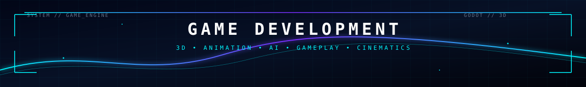
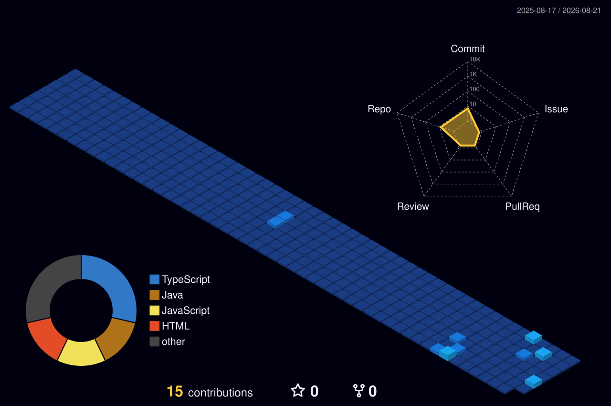

<div align="center">



<br>


<br><br>


</div>

---

# 👨‍💻 ABOUT ME

I'm **Muhamad Imran**, a Software Engineering graduate focused on building practical software, exploring modern development workflows, and continuously expanding into DevOps and infrastructure.

I enjoy working across the complete software lifecycle:

```text
             ┌──────────────┐
             │     IDEA     │
             └──────┬───────┘
                    ↓
             ┌──────────────┐
             │    DESIGN    │
             └──────┬───────┘
                    ↓
             ┌──────────────┐
             │   DEVELOP    │
             └──────┬───────┘
                    ↓
             ┌──────────────┐
             │     TEST     │
             └──────┬───────┘
                    ↓
             ┌──────────────┐
             │   AUTOMATE   │
             └──────┬───────┘
                    ↓
             ┌──────────────┐
             │    DEPLOY    │
             └──────┬───────┘
                    ↓
             ┌──────────────┐
             │   IMPROVE    │
             └──────┬───────┘
                    │
                    └───────────────↺
```

My main interests include:

Software Engineering · Web Development · DevOps · Automation · Game Development · UI/UX

## ⚡ ENGINEERING MINDSET

Don't just write code. Understand the system.

I believe good engineering is about more than making something work.

It's about understanding why it works, knowing how it can fail, and continuously improving how it is built, tested, deployed, and maintained.

```text
UNDERSTAND
     ↓
DESIGN
     ↓
BUILD
     ↓
DEBUG
     ↓
TEST
     ↓
AUTOMATE
     ↓
DEPLOY
     ↓
MONITOR
     ↓
OPTIMIZE
```

## 🛠️ TECH STACK

<div align="center">

### 💻 LANGUAGES


<br><br>

### 🌐 DEVELOPMENT


<br><br>

### ⚙️ DEVOPS & INFRASTRUCTURE


<br><br>

### 🎨 DESIGN & CREATIVE DEVELOPMENT


</div>

<br>

<div align="center">
  
</div>

## 🎮 GAME DEVELOPMENT

<div align="center">

### 🏰 RANIKOT CHRONICLES
**CINEMATIC 3D EXPLORATION EXPERIENCE**

</div>

A third-person cinematic exploration game inspired by Ranikot Fort, developed as a Software Engineering Final Year Project.

The project combines programming, 3D environments, gameplay systems, animation, AI, audio, narrative design, and optimization into a complete interactive experience.

### 🎮 GAMEPLAY SYSTEMS
* 🎥 Third-Person Camera
* 🏃 Character Movement
* ⚔️ Combat Mechanics
* 🤖 Enemy AI
* 🧩 Puzzle Mechanics
* 🧠 Choice-Based Narrative
* 🎬 Cinematic Sequences
* 🌍 3D Environment Design
* 🎨 Animation Systems
* 🔊 Ambient Audio & SFX
* 💾 Game Systems
* ⚡ Performance Optimization
* 🎛️ UI / Menu Systems

### 🧩 DEVELOPMENT PIPELINE

```text
                    BLENDER
                       │
                       ▼
                ┌─────────────┐
                │  3D ASSETS  │
                └──────┬──────┘
                       ↓
                ┌─────────────┐
                │ GODOT ENGINE│
                └──────┬──────┘
                       ↓
                ┌─────────────┐
                │   GDSCRIPT  │
                └──────┬──────┘
                       ↓
        ┌──────────────┼──────────────┐
        ↓              ↓              ↓
     GAMEPLAY          AI         ANIMATION
        │              │              │
        └──────────────┼──────────────┘
                       ↓
                  AUDIO / SFX
                       ↓
                  OPTIMIZATION
                       ↓
                  FINAL BUILD
```

### 🔥 CORE FOCUS

| Area | Technologies |
| :--- | :--- |
| **Engine** | Godot |
| **Language** | GDScript |
| **3D** | Blender |
| **Rendering** | OpenGL |
| **Gameplay** | Character / Combat / Puzzle |
| **AI** | Enemy Behaviors |
| **Animation** | Character & Gameplay Animation |
| **Audio** | Ambient / SFX |
| **Optimization** | Low-to-Mid Range PCs |

## 🚀 PROJECT SHOWCASE

<table>
  <tr>
    <td width="50%" valign="top">
      <h3>🎮 Ranikot Chronicles</h3>
      <p><b>Cinematic 3D Game</b></p>
      <p><i>Godot · GDScript · Blender</i></p>
      <p>Third-person exploration with gameplay systems, AI, animation, puzzles, narrative, and environmental design.</p>
    </td>
    <td width="50%" valign="top">
      <h3>🛒 E-Commerce Platform</h3>
      <p><b>Web Application</b></p>
      <p><i>JavaScript · HTML · CSS · REST APIs</i></p>
      <p>A practical e-commerce application exploring frontend, backend, API, and database architecture.</p>
    </td>
  </tr>
  <tr>
    <td width="50%" valign="top">
      <h3>🤖 AI Voice Assistant</h3>
      <p><b>AI / Automation</b></p>
      <p><i>Python · AI</i></p>
      <p>Voice interaction and automation focused project exploring intelligent software behavior.</p>
    </td>
    <td width="50%" valign="top">
      <h3>🌐 Developer Portfolio</h3>
      <p><b>Web / UI</b></p>
      <p><i>HTML · CSS · JavaScript</i></p>
      <p>Responsive portfolio experience designed to present projects, skills, and development work.</p>
    </td>
  </tr>
</table>

## ⚙️ DEVOPS MINDSET

I'm interested in the complete path from source code to production.

```text
        👨‍💻 CODE
           │
           ▼
        🔀 GIT PUSH
           │
           ▼
      ⚙️ CI / BUILD
           │
           ▼
        🧪 TEST
           │
           ▼
      🐳 DOCKER
           │
           ▼
      🚀 DEPLOY
           │
           ▼
      📊 MONITOR
           │
           ▼
      🔧 IMPROVE
           │
           └───────────────↺
```

### CURRENTLY EXPLORING

CI/CD · Docker · Linux · GitHub Actions · Automation · Cloud · Deployment · Monitoring

## 🧠 CURRENT LEARNING

```text
Software Engineering     ████████████████████
Web Development          ███████████████████░
DevOps / CI-CD           ████████████████░░░░
Linux / Automation       ███████████████░░░░░
Docker                   ██████████████░░░░░░
Cloud                    ████████████░░░░░░░░
Game Development         ███████████████░░░░░
```

## 📊 GITHUB ANALYTICS

<div align="center">
  
  
</div>

<br>

<div align="center">
  
</div>

## 🏆 GITHUB TROPHIES

<div align="center">
  
</div>

## 🐍 CONTRIBUTION ANIMATION

<div align="center">
  
</div>

## 🌌 3D CONTRIBUTION GRAPH

<div align="center">
  
</div>

## 🔬 HOW I BUILD

```python
class Engineer:

    def solve(self, problem):

        understand(problem)

        architecture = design(problem)

        solution = build(architecture)

        while not production_ready(solution):

            test(solution)
            debug(solution)
            optimize(solution)

        automate(solution)

        deploy(solution)

        return "continuous improvement"
```

## 🎯 CURRENT MISSION

```text
┌──────────────────────────────────────────────┐
│              ENGINEERING MISSION             │
├──────────────────────────────────────────────┤
│                                              │
│  [██████████████████████████████████████]    │
│  BUILD                                       │
│                                              │
│  [██████████████████████████████████████]    │
│  LEARN                                       │
│                                              │
│  [████████████████████████████████████░░]    │
│  AUTOMATE                                    │
│                                              │
│  [███████████████████████████████░░░░░░░]    │
│  SCALE                                       │
│                                              │
└──────────────────────────────────────────────┘
```

### LONG-TERM DIRECTION

Software Engineering → DevOps → Automation → Cloud → Scalable Systems

## 💡 ENGINEERING PRINCIPLES

1. Learn continuously.
2. Build real things.
3. Understand the fundamentals.
4. Automate repetitive work.
5. Debug before blaming.
6. Write maintainable code.
7. Optimize when it matters.
8. Document what you build.
9. Keep experimenting.
10. Never stop improving.

## 🤝 LET'S CONNECT

<div align="center">
  <a href="https://github.com/Imrannro">
    
  </a>
  <a href="YOUR_LINKEDIN_URL_HERE">
    
  </a>

<br><br>

**OPEN TO**

Software Engineering · Web Development · DevOps · Open Source

</div>

<br>

<div align="center">
  <h3>⚡ BUILD. AUTOMATE. DEPLOY. EVOLVE.</h3>
  
</div>